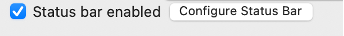
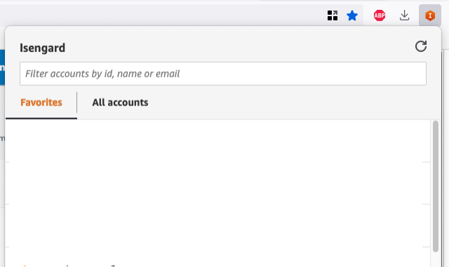

[TOC]

# Desktop

## Dock, Mission-Controls & Shortcuts

1. Create multiple Desktops spaces and use desktop to do separate tasks (see **system preferences > Mission Control**)
   | Keys | Description |
   | -------------- | -------------------------- |
   | ⌃ + ↑ | Mission Control |
   | ⌃ + ↓ | Application Windows |
   | ⌃ + → | Move right space |
   | ⌃ + < 1, 2.. > | Go to the specific desktop |

   

1. Other useful desktop shortcuts
   | Keys | Description |
   |------------|-----------------------------|
   | ⌘ + ⌥+ Q | Force quit the app |
   | ⌘ + ⌥+ Esc | Chose multiple apps to quit |
   | ⌘ + M | Minimize Window |
   | ⌘ + tab | Switch next app |
   | ⌘ + ⇧+ tab | Switch previous app |
   | ⌘ + ⇧ + Q | Log out |
   | ⌥ + D | Go to the dock |
   | ⌥ + ⌘ + D | Show or hide the dock |
   | ⌃+ ⌘ + Q | Lock your screen |

   

1. Use hot-corners for mission controls, desktop whenever the mouse cursor goes into that corner. ( **System preferences > mission control** )

   

1. Optimized dock size and menu bar visibility with following changes

- Make dock size small
- Remove auto hide menu bar option
- Double-click menu bar to zoom option
- Show battery status in percentage

  |                                         |                                         |
  | --------------------------------------- | --------------------------------------- |
  |  |  |

## Finder - Settings and shortcuts

1. Finder preferences

- Show status bar and path bar ( in **View menu > Status bar** )

  

- Use your preferred folder when finder launches and perform search on the current folder option

  |                                          |                                          |
  | ---------------------------------------- | ---------------------------------------- |
  |  |  |

  | Keys        | Description                 |
  | ----------- | --------------------------- |
  | ⌘ + I       | Get more info about file    |
  | ⌘ + D       | Duplicate the file          |
  | ⇧ + ⌘ + D   | Go to Desktop               |
  | ⇧ +⌘ + H    | Go to home folder           |
  | ⌘ + F       | Find                        |
  | ⌘ + G       | Find again                  |
  | ⌘ + O       | Open selected item or file  |
  | ⌘ + W       | Close the front window      |
  | ⌘ + ⇧ + W   | Close all windows           |
  | ⌘ + F       | Use app in full screen mode |
  | ⌘ + N       | Create new folder           |
  | ⌘ + ,       | Open preferences            |
  | ⌘ + 1, 2, 3 | List view, icon view...     |

## Iterm2 - Settings

1. Terminal Settings: (Go to **Profiles > Default > General** )

- Use working directory of your choice when terminal starts

  

- Set terminal font and cursor settings

  - Use cursor vertical bar and disable blinking
  - Font based on your theme

  

  _Note : Installing a patched font will mess up the integrated terminal
  in VS Code unless you use the proper settings. You'll need to go to
  settings (CMD + ,) and add or edit the following values:_
  _for Meslo: "terminal.integrated.fontFamily": "Meslo LG M for Powerline"_

- Set Windows size

  - Column size to 120 and rows=25
  - Opt for unlimited scroll back and silence bell

  

- Key Settings (Profile)

  - Configure Status bar to show more info like git branch by adding component

  

  _(Note: useful for terminal navigation. Like jump by word)_

- Terminal session status bar (Profile)
  | | |
  | ---------------------------------------- | ---------------------------------------- |
  |  |  |

### Tmux

- Multiplexer for terminal windows

```
    brew install tmux
```

| Keys                        | Description                              |
| --------------------------- | ---------------------------------------- |
| tmux new -s [session name]  | Start a new session                      |
| ctrl+b d                    | Detach from session                      |
| tmux ls                     | List sessions                            |
| tmux a -t [name of session] | Attach to named session                  |
| ctrl+b "                    | Split panes horizontally                 |
| ctrl+b %                    | Split panes vertically                   |
| ctrl+b x                    | Kill current pane                        |
| ctrl+b [arrow key           | Move to another pane                     |
| ctrl+b o                    | Cycle through panes                      |
| ctrl+b r <H, J, K, L>       | Resize panes horizontally and vertically |

### Install oh-my-zsh

1. Install under your /home/.oh-my-zsh folder

```
  sh -c "$(curl -fsSL https://raw.githubusercontent.com/ohmyzsh/ohmyzsh/master/tools/install.sh)"

```

2. Install useful plugins -- zsh auto-suggestions zsh-syntax-highlighting plugin

```
    # autosuggesions plugin
    git clone https://github.com/zsh-users/zsh-autosuggestions.git $ZSH_CUSTOM/plugins/zsh-autosuggestions

    # zsh-syntax-highlighting plugin
    git clone https://github.com/zsh-users/zsh-syntax-highlighting.git $ZSH_CUSTOM/plugins/zsh-syntax-highlighting

    # zsh-autocomplete plugin (optional)
    git clone --depth 1 -- https://github.com/marlonrichert/zsh-autocomplete.git $ZSH_CUSTOM/plugins/zsh-autocomplete
    cd zsh-autocomplete source
    ./zsh-autocomplete.plugin.zsh
```

3. Configure \~/.zshrc to use the above installed plugins

- Add following plugins in \~/.zshrc file

```
  plugins=(git aws docker kubectl vi-mode zsh-autosuggestions zsh-syntax-highlighting)
```

4. Add the binding keys
   _Optional: Some key bindings and aliases need to be added in \~/.zshrc for easier navigation in the terminal_

```
    # bindkey
    bindkey "^U"    backward-kill-line
    bindkey "^u"    backward-kill-line
    bindkey "^[l"   down-case-word
    bindkey "^[L"   down-case-word

    # alt+<- | alt+->
    bindkey "^[f" forward-word
    bindkey "^[b" backward-word

    # ctrl+<- | ctrl+->
    bindkey "^[[1;5D" backward-word
    bindkey "^[[1;5C" forward-word

```

5. Add aliases for isengard, nvim etc

```
    # aliases for isengard
    alias ig=isengardcli
    alias igl='isengardcli list'
    alias iga='isengardcli assume'

    # vim aliases
    alias vim="nvim"
```

6. Install powerlevel10k theme

```
    git clone --depth=1 https://github.com/romkatv/powerlevel10k.git ${ZSH_CUSTOM:-$HOME/.oh-my-zsh/custom}/themes/powerlevel10k

```

## Isengard cli

1. Command overview
   | isengard command | description |
   | ---------------------------------------- | ---------------------------------------- |
   |isengardcli assume <account-name> | Select list or provide account name |
   |isengardcli open <account-name> | Open account with default role or list of roles |
   |Isengardcli create | Create account |
   |Isengardcli ls | List of accounts |
   |isengardcli assume <account-name> | Select list or provide account name |

1. Following isengard aliases created in .zshrc file
   | isengard command | description |
   | ---------------------------------------- | ---------------------------------------- |
   | iga | Isengard assume |
   | igl | Isengard list |
   | igo | Isengard opeen |

## Firefox

### Multi-container

- Opens account console in new session (useful for multi account testing)

- Shows container info

  <https://w.amazon.com/bin/view/Users/drdhall/Firefox_Multi_Container_NAWS/>

  

  

### Chrome Extension: Isengard

- Enables to assume roles and switch between Isengard accounts

  <https://w.amazon.com/bin/view/AWSIdentity/AWSIdentityUX/Mordor/>

  

# Development

## asdf

- Tool version manager. All tool version definitions are contained within one file (.tool-versions)

- Ensures teams are using the exact same versions of tools, with support for many tools via a plugin system

### Installation asdf

```
    # Install dependencies
    brew install coreutils curl git

    # Install asdf
    brew install asdf

    # Add any plugin you need (terraform, python, kubectl, nodejs[)]{.underline}

    $ asdf plugin-add terraform https://github.com/asdf-community/asdf-hashicorp.git
    $ asdf plugin-add python
    $ asdf plugin-add kubectl

    # Install
    $ asdf install nodejs 16.18.0
    $ asdf install python latest

```

### List plugins and show current version

```
    $ asdf current terraform
    $ asdf list
    $ asdf list-all nodejs
    $ asdf list-all python
    $ asdf current python
    $ asdf current nodejs
```

### Install default packages by npm

```
    $ touch ~/.default-npm-package
    $ cat ~/.default-npm-packages
    pnpm
    npm-check-updates
    degit
    prettier

    $ asdf reshim nodejs
```

#### Set version of the tool

- Global defaults are managed in \$HOME/.tool-versions. Local versions are defined in the \$PWD/.tool-versions

  # Set global or local version

```
    asdf global nodejs 16.18.0
    asdf local python 3.11.1
```

  

- Add following line to the endo of .zshrc to source the asdf

```
  source $HOME/.asdf/asdf.sh
```

## Visual Studio

### Useful Extensions

| Category        | Extensions                                                               |
| --------------- | ------------------------------------------------------------------------ |
| Version Control | Git, GitGraph, Gitlens                                                   |
| Tools           | AWS Toolkit, Hashicorp Terraform, ESLint, npm, JavaScript and Typescript |
| Themes          | Material Icon Theme, File Tree Viewer                                    |
| Format Checker  | Prettier                                                                 |
| DevOps          | LiveShare, Docker Containers, Markdown                                   |

### Settings

| Category                               | Description         |
| -------------------------------------- | ------------------- |
| workbench.colorTheme                   | Cobalt2             |
| editor.tabSize                         | 2                   |
| editor.minimap.enabled                 | false               |
| terminal.integrated.defaultProfile.osx | zsh                 |
| breadcrumbs.enabled                    | false               |
| terrminal.integrated.scrollback        | 90000               |
| workbench.iconTheme                    | material-icon-theme |
| explorer.compactFolders                | false               |
| editor.rename.enablePreview            | false               |

### Settings (workspace)

```
    {
      "breadcrumbs.enabled": false,
      "editor.tabSize": 2,
      "editor.wordWrap": "on",
      "editor.lineNumbers": "on",
      "editor.codeLens": false,
      "editor.folding": true,
      "editor.glyphMargin": false,
      "editor.formatOnSave": true,
      "editor.minimap.enabled": false,
      "editor.cursorBlinking": "blink",
      "editor.renderWhitespace": "none",
      "editor.suggestSelection": "first",
      "editor.guides.indentation": false,
      "editor.renderControlCharacters": false,
      "editor.cursorSmoothCaretAnimation": true,
      "editor.bracketPairColorization.enabled": false,
      "editor.defaultFormatter": "esbenp.prettier-vscode",
      "editor.wordSeparators": "/\\()\"':,.;<>~!@#$%^&*|+=[]{}`?-",
      "editor.renderLineHighlight": "all",
      "editor.fontLigatures": true,
      "search.searchOnType": false,
      // font settings
      "editor.rename.enablePreview": false,
      "editor.fontFamily": "Insolata, Menlo, Monaco, 'Courier New', monospace",
      "terminal.integrated.fontFamily": "'Source Code Pro for Powerline', Insolata, Menlo, Monaco, 'Courier New', monospace",
      "terminal.integrated.fontSize": 12,
      "terminal.integrated.scrollback": 90000,
      "terminal.integrated.defaultProfile.osx": "zsh",
      "terminal.integrated.drawBoldTextInBrightColors": false,
      "terminal.integrated.copyOnSelection": true,
      "terminal.integrated.cursorBlinking": true,
      "terminal.integrated.tabs.enabled": false,
      "workbench.fontAliasing": "antialiased",
      "workbench.statusBar.visible": true,
      "workbench.iconTheme": "material-icon-theme",
      "workbench.colorTheme": "Cobalt2",
      "explorer.compactFolders": false,
      "files.trimTrailingWhitespace": true,
      "files.exclude": {
        "**/node_modules": true,
        "**/package-lock.json": true,
        // Hide js files after running tsc.
        "**/*.js": { "when": "$(basename).ts" },
        "**/*.d.ts": { "when": "$(basename).ts" }
      }
    }

```

## Neovim

A vim based editor with large sets of plugins and community support.

### Installation :

```
    $ brew install neovim
    $ brew install ripgrep (needed for live-grep in Telescope)
```

### Documentation:

- <https://www.youtube.com/watch?v=vdn_pKJUda8>
- <https://www.youtube.com/watch?v=b7OguLuaYvE>
- <https://github.com/neovim/neovim>
- <https://github.com/hackorum/nfs>

### Shortcuts

- Tab Navigation

  | Shortcut Key | Description  |
  | ------------ | ------------ |
  | ⇓ + to       | Tab open     |
  | ⇓ + tx       | Tab close    |
  | ⇓ + tn       | Tab next     |
  | ⇓ + tp       | Tab previous |

- Windows
  | Shortcut Key | Description |
  | ------------ | ------------ |
  | ⇓ + jk | Change to normal mode (equal to Esc) |
  | ⇓ + nh | Remove search results |
  | ⇓ + sv | Split window vertically |
  | ⇓ + sh | Split window horizontally |
  | ⇓ + se | Split window equally |
  | ⇓ + sx | Split window close |
  | ^ + H, L | Navigate to horizontal windows |
  | ^ + J, K | Navigate between vertical windows |
  | ^ + u | Scroll up half page |
  | ^ + d | Scroll down half page |
  | H, M, L | Move to Highest, Middle and Lowest viewport |
  | 0, \$ | Move to first or end of line |
  | ^ + o | Go to older cursor position |
  | ^ + i | Go to newer position in the tab (next tab) |
  | ^ + ww | Toggle between Treee and File explorer |

- Editing

  | Shortcut Key                  | Description                                  |
  | ----------------------------- | -------------------------------------------- |
  | <line-number>gg               | Go to line number                            |
  | <line-number> + j,k           | Go to relative line number                   |
  | :noh                          | Clear results                                |
  | ysiw                          | Surround word with quotes                    |
  | ysb                           | Surround word with brackets                  |
  | ds                            | Revert to original                           |
  | yw + grw                      | Copy selected word and replace the selection |
  | I                             | Insert at beginning of line                  |
  | A                             | Append to the current line                   |
  | w, b                          | Move word or back                            |
  | e                             | Move to end of the word                      |
  | cc                            | Change current line                          |
  | (                             | Sentences forward                            |
  | )                             | Sentences backward                           |
  | {                             | Move Paragraph forward                       |
  | }                             | Move Paragraph backward                      |
  | f {char}                      | Move to specific char                        |
  | cc                            | Change current line                          |
  | %s/<search-str>/<replace-str> | Search replace                               |
  | /{pattern}                    | Search forward                               |
  | ?{pattern}                    | Search backward                              |
  | %                             | Jump to matching ([{}])                      |
  | ^ + v , shift + i, Esc        | Column mode editing using the combination    |
  | ^ + M                         | Move horizontall to middle of the line       |

- LSP

  | Shortcut Key     | Description                              |
  | ---------------- | ---------------------------------------- |
  | ⇓ + gf           | Find references                          |
  | ⇓ + gD           | Go to declaration                        |
  | ⇓ + gd           | See definitions and make edits in window |
  | ⇓ + gi           | Go to implementation                     |
  | ⇓ + gr           | Rename                                   |
  | ⇓ + ca           | Code Action                              |
  | ⇓ + rn           | Smart rename                             |
  | ⇓ + K            | Documentation for what is under cursor   |
  | ⇓ + oi           | Organize import                          |
  | ⇓ + n            | Jump to next diagonistic                 |
  | ⇓ + N            | Jump to previous diagonistic             |
  | gcc              | Comment line                             |
  | visual mode + gc | Block comment                            |
